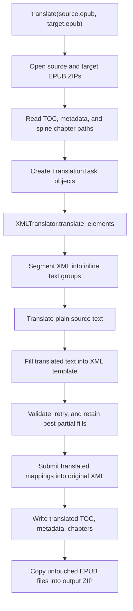

# Project Architecture

## Purpose

`epub-translator` is a Python library for turning an EPUB into a translated EPUB while preserving the original book structure. Its main output mode is bilingual: translated text is inserted next to the original text while keeping existing chapters, metadata, table of contents, images, MathML, inline markup, and EPUB packaging intact.

The public API is intentionally small:

- `LLM`: OpenAI-compatible chat client wrapper with token counting, retries, optional caching, and prompt templates.
- `translate`: end-to-end EPUB translation orchestration.
- `language`: predefined target language names.
- `SubmitKind`: controls how translated text is written back into XML.
- `FillFailedEvent`: callback payload for XML-fill validation failures.

## Repository Layout

```text
epub_translator/
  __init__.py                 Public package exports
  data/                       Jinja prompts used by LLM translation/fill stages
  epub/                       EPUB ZIP, OPF, spine, TOC, metadata, and MathML helpers
  llm/                        LLM client, request context, caching, retries, statistics
  segment/                    XML text/block/inline segmentation and validation models
  serial/                     Small chunk/segment splitting utilities
  translation/                End-to-end EPUB translation orchestration
  xml/                        XML-like parsing, namespace handling, friendly XML codec
  xml_translator/             XML-safe translation pipeline and insertion logic
scripts/                      Manual/dev translation scripts
tests/                        Unit and integration tests plus EPUB fixtures
docs/                         Development notes, changelog, reports, images
```

## High-Level Flow



The important design choice is that translation is split into two LLM operations:

1. Translate source text as plain text.
2. Ask the model to fit the translated text back into a constrained XML template.

This keeps translation quality separate from structural preservation. The second stage is validated and retried so the output can be inserted without corrupting the EPUB XML.

## Public API Layer

[epub_translator/__init__.py](epub_translator/__init__.py) re-exports the stable user-facing API from the internal packages.

Typical usage:

```python
from epub_translator import LLM, SubmitKind, language, translate

llm = LLM(
    key="...",
    url="https://api.openai.com/v1",
    model="gpt-4",
    token_encoding="o200k_base",
)

translate(
    source_path="source.epub",
    target_path="translated.epub",
    target_language=language.ENGLISH,
    submit=SubmitKind.APPEND_BLOCK,
    llm=llm,
)
```

`translate` accepts either a single `llm` for both stages or separate `translation_llm` and `fill_llm` instances. Separate models/configurations are useful because free-form translation and XML filling have different model behavior requirements.

## End-to-End Translation Orchestration

The main orchestration lives in [epub_translator/translation/translator.py](epub_translator/translation/translator.py).

Responsibilities:

- Validate that an LLM is available for both translation and fill stages.
- Create an `XMLTranslator` configured with target language, prompts, retry policy, concurrency, and token limits.
- Open the source EPUB through `Zip` and write a new target EPUB.
- Preserve `mimetype` as the first migrated file.
- Read TOC, metadata, and chapter body elements.
- Convert TOC and metadata into temporary XML so they can reuse the XML translation pipeline.
- Track progress with weighted phases: TOC, metadata, and chapters.
- Write translated TOC, metadata, and chapter files back into the target EPUB.
- Deduplicate IDs after inserting translated chapter content.

Task generation happens in `_generate_tasks_from_book`. It yields:

- one TOC task when a TOC exists,
- one metadata task when translatable metadata fields exist,
- one chapter task per XHTML/HTML spine document that has a `<body>`.

When `SubmitKind.APPEND_BLOCK` is requested for TOC or metadata, the task is downgraded to `APPEND_TEXT`; TOC and metadata fields are short text records rather than chapter body blocks.

## EPUB Layer

The [epub_translator/epub](epub_translator/epub) package isolates EPUB-specific file handling.

- `zip.py`: wraps source and target ZIP files. Changed files are written through `replace`; untouched files are automatically migrated on exit.
- `common.py`: locates core EPUB files such as the OPF package file.
- `spines.py`: reads the OPF manifest and spine to find ordered chapter documents.
- `toc.py`: reads and writes EPUB 2 NCX and EPUB 3 nav TOCs into a shared `Toc` tree model.
- `metadata.py`: reads and writes selected OPF metadata fields, skipping technical fields such as language, identifiers, dates, and meta records.
- `math.py`: contains MathML-specific handling used by tests and EPUB preservation logic.

The EPUB layer generally works with `XMLLikeNode`, not raw strings, so encoding, namespaces, and XML/HTML serialization remain centralized.

## XML Normalization And Friendly XML

The [epub_translator/xml](epub_translator/xml) package handles the messy reality of EPUB XML.

Key parts:

- `XMLLikeNode` parses XML-like or HTML-like files, detects encoding, preserves headers, normalizes HTML entities, temporarily strips namespaces into simpler tag/attribute names, and restores namespaces during save.
- `self_closing.py` handles HTML void elements so non-XHTML HTML can be parsed and written safely.
- `inline.py`, `xml.py`, and `utils.py` provide traversal, text extraction, cloning, inline-element checks, and tree utilities.
- `deduplication.py` fixes duplicate IDs after translated blocks are inserted.
- `friendly/` implements a custom forgiving XML encoder/decoder used for LLM prompts and responses.

The friendly XML codec is deliberately separate from `xml.etree` parsing. LLM responses often contain Markdown fences, explanatory text, or imperfect XML snippets. `decode_friendly` scans text and extracts complete matching elements instead of requiring the whole response to be a valid XML document.

## Segmentation Model

The [epub_translator/segment](epub_translator/segment) package turns an XML tree into translation-sized units while remembering how each text fragment maps back to the original structure.

Core concepts:

- `TextSegment`: a normalized text fragment with parent stack, block depth, and text/tail position.
- `InlineSegment`: a group of text segments that should be translated together as an inline reading unit.
- `BlockSegment`: a larger template containing inline segments with generated IDs for fill validation.
- `combine_text_segments`: rebuilds XML fragments from translated text segments.

This layer is also responsible for structural validation errors:

- missing or unexpected IDs,
- wrong block tags,
- inline tag count mismatches,
- lost or unexpected inline IDs,
- invalid generated IDs.

The XML translator uses these errors to tell the fill LLM exactly what to correct.

## XML Translation Pipeline

The [epub_translator/xml_translator](epub_translator/xml_translator) package is the core XML-safe translation engine.

### `XMLTranslator`

[xml_translator/translator.py](epub_translator/xml_translator/translator.py) coordinates translation for one or many `TranslationTask` objects.

For each group of inline segments:

1. Render source text from the inline segments.
2. Send that text to the translation LLM using `data/translate.jinja`.
3. Build an XML template from the original structure.
4. Send source text, XML template, and translated text to the fill LLM using `data/fill.jinja`.
5. Extract a single `<xml>...</xml>` block from the response.
6. Submit the candidate XML to `HillClimbing`.
7. Retry with validation feedback until success or retry limit.
8. Convert accepted filled blocks into mappings.
9. Submit mappings back into the original element using the requested `SubmitKind`.

### Stream Mapping And Chunking

[xml_translator/stream_mapper.py](epub_translator/xml_translator/stream_mapper.py) converts element streams into token-bounded work groups.

It uses:

- `resource-segmentation` to split by score,
- `tiktoken` encoding to estimate token cost,
- head/body/tail context around each group so translations have enough surrounding text,
- optional concurrency through `run_concurrency`.

The mapper yields translated mappings in original document order, even when execution is concurrent.

### Hill Climbing Validation

[xml_translator/hill_climbing.py](epub_translator/xml_translator/hill_climbing.py) stores the best known fill result per block.

The fill LLM may improve some blocks while breaking others. Instead of accepting or rejecting an entire response, `HillClimbing`:

- validates submitted XML against the expected block structure,
- computes weighted error groups,
- keeps lower-error submissions for each block,
- generates concise correction messages,
- eventually exposes the best mappings available.

This makes retries more resilient when a model fixes one section at a time.

### Submit Modes

[xml_translator/submitter.py](epub_translator/xml_translator/submitter.py) writes translated mappings into the original XML.

`SubmitKind` supports:

- `REPLACE`: replace original translatable text with translated content.
- `APPEND_TEXT`: append translated text inline after the original text.
- `APPEND_BLOCK`: append translated block elements after the original block.

The submitter handles both simple "peak" structures and nested "platform" structures, where a block contains other translatable block elements. Non-inline elements, such as images, are preserved during replacement.

## LLM Layer

The [epub_translator/llm](epub_translator/llm) package wraps OpenAI-compatible chat completion calls.

Responsibilities:

- `core.py`: user-facing `LLM` class, prompt template loading, token encoding, logger creation, statistics access.
- `executor.py`: streaming chat completion calls, retries for retryable API/network failures, optional request/response logging.
- `context.py`: per-request context with cache lookup, temporary cache writes, commit/rollback behavior, and temperature/top-p increasers.
- `increasable.py`: supports static or increasing sampling parameters across retries.
- `statistics.py`: accumulates usage from streaming responses.
- `types.py`: message dataclasses and roles.

Prompt templates are loaded from [epub_translator/data](epub_translator/data):

- `translate.jinja`: plain text translation instructions.
- `fill.jinja`: XML filling instructions.

Caching is content-addressed by message payload plus a cache seed. The EPUB translator uses package version and target language as the seed so cache entries are invalidated when behavior changes meaningfully.

## TOC And Metadata Transcoding

[translation/epub_transcode.py](epub_translator/translation/epub_transcode.py) converts EPUB data models into temporary XML:

- `Toc` trees become `<toc-list><toc-item>...`.
- metadata fields become `<metadata-list><field tag="...">...`.

After translation, those temporary XML elements are decoded back into `Toc` and `MetadataField` objects and written through the EPUB layer.

This lets TOC, metadata, and chapter bodies share the same XML translation/validation pipeline.

## Concurrency And Ordering

Concurrency is configured through `translate(..., concurrency=N)` and passed into `XMLTranslator`.

The concurrency layer is intentionally below the orchestration layer:

- The EPUB writer still processes translated elements in stream order.
- The stream mapper splits text into independent groups.
- `run_concurrency` executes group translation/fill work in parallel.
- Results are re-associated with their original element and submitted in order.

Because the LLM cache writes through temporary files and commits under a lock, concurrent requests can share a cache directory without corrupting committed entries.

## Development Scripts

The [scripts](scripts) directory contains manual workflows:

- `translate_epub.py`: command-line EPUB translation with progress bar, cache/log paths, token usage summary, and fill failure reporting.
- `translate_xml.py`: direct XML translator exercise using a synthetic XML sample.
- `translate_challenge.py`: challenge-case workflow for difficult fill examples.
- `check_duplicate_ids.py`: utility for inspecting duplicate IDs.
- `utils.py`: loads `format.json` from `format.template.json`-style configuration and manages temporary output.

These scripts are development aids rather than installed console entry points.

## Testing Strategy

The [tests](tests) directory covers the architecture by layer:

- XML-like parsing and friendly XML encoding/decoding.
- Text, inline, block, and serial segmentation behavior.
- Submit modes and nested XML insertion.
- Scoring, validation, and retry-support logic.
- EPUB metadata, spine, TOC, MathML, and transcoding.
- Real EPUB fixture handling with files in `tests/assets`.

Run the suite with:

```bash
poetry run pytest
```

Static tooling configured in [pyproject.toml](pyproject.toml):

```bash
poetry run ruff check .
poetry run ruff format .
poetry run pyright
poetry run pylint epub_translator
```

## Extension Points

Common changes usually fit one of these areas:

- New user-facing translation options: start in `translation/translator.py`, then pass behavior into `XMLTranslator` or EPUB helpers.
- New submit behavior: extend `SubmitKind` and `xml_translator/submitter.py`, then add tests around peak and platform structures.
- Better XML compatibility: update `xml/xml_like.py`, `self_closing.py`, or namespace handling, backed by EPUB fixture tests.
- Better fill validation: update `segment` validation models and `xml_translator/validation.py`.
- Prompt behavior changes: edit `data/translate.jinja` or `data/fill.jinja`; consider whether the cache seed should change.
- Model/provider options: add fields to `LLM` or `LLMExecutor` while preserving OpenAI-compatible behavior.

## Architectural Invariants

Keep these constraints in mind when changing the project:

- EPUB files are ZIP packages; untouched files should be migrated unchanged.
- The `mimetype` entry must remain first in the output ZIP.
- Original XML/HTML encoding and namespaces should be preserved as much as possible.
- Translation should operate on readable text, but insertion must operate on validated XML mappings.
- LLM responses are untrusted; always parse, validate, retry, and preserve best partial results.
- Chapter order and result order must remain stable even when concurrency is enabled.
- Non-text assets and non-inline structural elements should survive translation unchanged.
- Duplicate IDs can be introduced by appended translations and must be cleaned before writing chapters.
