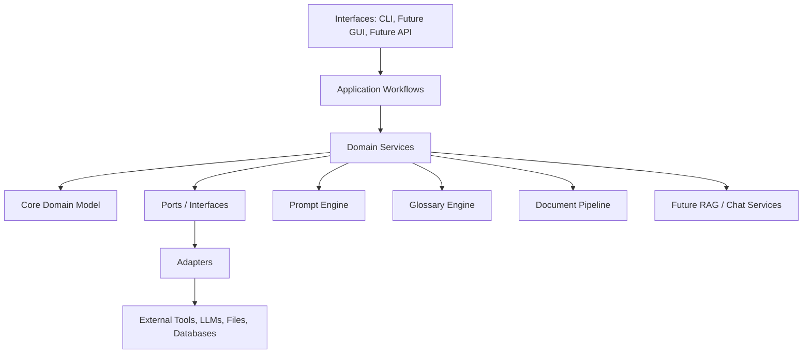

# ResearchReader Design

## Vision

ResearchReader is a long-term AI research reading platform for importing books and papers, translating or normalizing them when useful, building structured knowledge from them, and supporting deep reading through notes, glossaries, citations, summaries, and AI chat.

`epub-translator` is not the architecture of ResearchReader. It is one adapter in the adapter layer: useful for EPUB translation, but replaceable and isolated from the platform core.

This document is architectural only. No functionality should be implemented until the design is reviewed.

## Core Principles

- Keep the platform core independent from document formats, LLM vendors, and UI surfaces.
- Treat document converters, translators, embedding providers, and storage engines as adapters.
- Preserve source documents and generated artifacts with reproducible manifests.
- Make prompts, glossary rules, and provider settings configurable and versionable.
- Support both single-book workflows and future library-scale research collections.
- Design for CLI first, with a future GUI using the same services.

## Layered Architecture



### Interface Layer

The interface layer exposes the same core capabilities through different entry points:

- CLI for initial workflows and automation.
- Future desktop or web GUI for reading, review, chat, and project management.
- Future local API for integrations.

Interfaces should not contain business logic. They should validate user input, call application workflows, and display results.

### Application Workflow Layer

Workflow modules coordinate complete user tasks:

- import a document,
- translate a document,
- build a reading package,
- extract glossary terms,
- summarize chapters,
- prepare a chat index,
- export notes and reports.

Workflows compose services and adapters but should avoid format-specific logic.

### Domain Service Layer

Services implement reusable platform behavior:

- document ingestion and normalization,
- metadata extraction,
- translation orchestration,
- glossary extraction and application,
- prompt rendering,
- summarization,
- note generation,
- citation and quote tracking,
- run logging and artifact manifests,
- future embedding and retrieval operations.

### Core Domain Model

The domain model should describe platform concepts without depending on EPUB, OpenAI, vector databases, or GUI frameworks.

Expected domain objects:

- `Document`: imported source with identity, metadata, and file references.
- `DocumentSection`: normalized chapter, page, article section, or heading range.
- `TextSpan`: text with location, offsets, and optional source markup reference.
- `ReadingProject`: user workspace containing documents, outputs, glossaries, and notes.
- `TranslationJob`: target language, provider profile, submit strategy, status, and artifacts.
- `Glossary`: canonical terms, translations, definitions, aliases, and source references.
- `PromptProfile`: named prompt set with version and variables.
- `RunManifest`: reproducibility record for an operation.

### Port And Adapter Layer

Ports define what the core needs. Adapters implement those ports for specific tools.

Example ports:

- `DocumentImporter`
- `DocumentExporter`
- `TranslationProvider`
- `LLMProvider`
- `EmbeddingProvider`
- `VectorStore`
- `PromptRepository`
- `GlossaryRepository`
- `ArtifactStore`
- `Logger`

Adapters should be thin. They translate between ResearchReader domain objects and external libraries or services.

## Proposed Folder Structure

```text
researchreader/
  DESIGN.md
  README.md
  pyproject.toml
  config/
    default.toml
    local.example.toml
    providers.example.toml
  prompts/
    profiles/
      default/
        manifest.toml
        translate.md
        summarize.md
        glossary.md
        chat.md
  glossaries/
    default.toml
  researchreader/
    __init__.py
    cli/
      main.py
      commands/
        import_doc.py
        translate.py
        summarize.py
        chat.py
    app/
      workflows/
        import_document.py
        translate_document.py
        build_reading_package.py
        build_chat_index.py
    core/
      models.py
      events.py
      errors.py
      ports.py
    services/
      documents.py
      translation.py
      summaries.py
      notes.py
      manifests.py
      logging.py
    pipeline/
      stages.py
      runner.py
      artifacts.py
    prompts/
      engine.py
      repository.py
      templates.py
    glossary/
      engine.py
      repository.py
      matcher.py
    rag/
      chunking.py
      embeddings.py
      retrieval.py
      chat.py
    adapters/
      documents/
        epub_translator_adapter.py
        epub_importer.py
        pdf_importer.py
        markdown_importer.py
      llm/
        openai_compatible.py
        anthropic.py
        local_model.py
      storage/
        filesystem.py
        sqlite.py
        vector_store.py
      plugins/
        loader.py
        registry.py
    ui/
      gui_placeholder.md
    config.py
    paths.py
  output/
    .gitkeep
  tests/
    core/
    services/
    adapters/
    workflows/
```

This structure is a target shape, not an instruction to create all files immediately.

## Adapters

Adapters connect ResearchReader to external formats, libraries, services, and storage systems.

### Document Adapters

Document adapters import, normalize, transform, or export documents.

Planned adapters:

- EPUB importer and exporter.
- PDF importer.
- Markdown/plain text importer.
- `epub-translator` adapter for EPUB translation.
- Future OCR adapter for scanned PDFs.
- Future citation metadata adapter for DOI, ISBN, Crossref, or Zotero-like sources.

The `epub-translator` adapter should:

- use only `epub_translator` public API,
- expose capabilities through ResearchReader's `TranslationProvider` or document transformation port,
- convert ResearchReader config into `epub_translator.LLM` and `translate` arguments,
- write outputs through ResearchReader's artifact system,
- report progress and fill failures as ResearchReader events.

It should not:

- become the central document model,
- leak private `epub_translator` types into ResearchReader services,
- require every ResearchReader document workflow to be EPUB-based.

### LLM Adapters

LLM adapters implement a common provider interface.

Planned providers:

- OpenAI-compatible APIs.
- Anthropic-compatible APIs.
- Local model servers.
- Future batch/offline providers.

Each provider should support:

- chat completion,
- structured output where available,
- streaming where useful,
- usage accounting,
- retry and timeout policy,
- provider-specific options without contaminating the core model.

### Storage Adapters

Storage should begin with filesystem artifacts and grow toward structured stores.

Planned adapters:

- filesystem artifact store,
- SQLite metadata store,
- future vector database,
- future cloud project store.

## Services

Services are reusable platform capabilities used by workflows and interfaces.

### Document Service

Owns document import, metadata extraction, section normalization, and artifact registration.

Responsibilities:

- assign stable document IDs,
- preserve source files,
- extract or normalize metadata,
- expose document sections to downstream services,
- record import manifests.

### Translation Service

Coordinates translation independent of any one translator.

Responsibilities:

- select a translation adapter,
- apply language and glossary configuration,
- call the prompt engine where applicable,
- report progress events,
- register translated artifacts,
- record provider and prompt metadata in the run manifest.

`epub-translator` is one implementation path for EPUB translation, not the service itself.

### Summary And Notes Service

Generates summaries, reading notes, chapter outlines, quote collections, and study aids.

Responsibilities:

- select prompt profiles,
- chunk sections safely,
- cite source locations,
- write Markdown or structured note artifacts,
- support incremental regeneration.

### Manifest Service

Creates reproducibility records for every run.

Each manifest should include:

- input document IDs and hashes,
- output artifact paths,
- workflow name and version,
- provider names and model identifiers,
- prompt profile and prompt versions,
- glossary version,
- configuration snapshot with secrets removed,
- timestamps and status.

### Logging Service

Provides platform logging and event capture.

Logging should support:

- user-readable progress logs,
- structured event logs,
- provider request logs when explicitly enabled,
- error logs,
- run-level correlation IDs.

Secrets must never be logged.

## Plugin System

ResearchReader should support a plugin system once the core ports stabilize.

Plugins may provide:

- document importers,
- exporters,
- LLM providers,
- embedding providers,
- vector stores,
- prompt packs,
- glossary packs,
- workflow commands,
- GUI panels in the future.

Plugin design:

- Plugins declare capabilities in a manifest.
- The platform loads plugins through a registry.
- Plugins register implementations for known ports.
- Plugins should not mutate global state during import.
- Plugins should receive scoped configuration.
- Plugin failures should degrade gracefully and be visible in diagnostics.

Initial development can use built-in adapters with the same registration shape that future plugins will use.

## Prompt Engine

The prompt engine manages platform prompts independently from provider adapters.

Responsibilities:

- load prompt profiles from disk,
- render templates with typed variables,
- support prompt manifests and versioning,
- validate required variables,
- support model/provider-specific prompt variants,
- record prompt profile and version in manifests,
- allow future prompt packs through plugins.

Prompt types:

- translation guidance,
- summarization,
- glossary extraction,
- note generation,
- question answering over a book,
- citation checking,
- critique and research synthesis.

Prompts should live as reviewable text files. Code should not contain large prompt bodies unless there is a strong reason.

## Glossary Engine

The glossary engine manages terminology across books, projects, and languages.

Responsibilities:

- store canonical terms, aliases, definitions, translations, and notes,
- extract candidate terms from documents,
- match terms across source and translated text,
- inject glossary constraints into prompts,
- produce glossary reports,
- support user-approved and AI-suggested entries,
- track source references for each term.

Glossary data should be portable. A TOML, YAML, JSON, or SQLite-backed repository can be used depending on scale.

Future glossary workflows:

- build glossary before translation,
- enforce consistent translation of terms,
- identify unknown technical terms,
- export study cards,
- compare terminology across multiple books.

## Document Pipeline

The document pipeline should model reading workflows as staged transformations.

Example stages:

1. Import source document.
2. Normalize metadata and sections.
3. Extract text spans and structural markers.
4. Detect language and document type.
5. Extract glossary candidates.
6. Translate or transform content if requested.
7. Generate summaries and notes.
8. Build embeddings for future retrieval.
9. Write artifacts and manifest.

Pipeline requirements:

- stages should be resumable where practical,
- each stage should declare inputs and outputs,
- artifacts should be content-addressed or run-scoped,
- failures should preserve completed artifacts,
- long-running stages should emit progress events.

## Future RAG Support

RAG support should be added as a service layer over normalized document sections, not bolted directly onto one file format.

Planned components:

- chunking strategy that respects document sections and citations,
- embedding provider port,
- vector store port,
- retriever service,
- reranking adapter where available,
- citation-aware answer composer,
- index manifests.

RAG should support:

- one book,
- a project library,
- filtered subsets by author, topic, language, tag, or date,
- regenerated indexes when documents or chunking rules change.

## AI Chat Over Books

AI chat should be a first-class reading workflow.

Capabilities:

- ask questions about one book or a project library,
- answer with citations to sections or page-like locations,
- summarize a chapter or selected passage,
- explain terms using the glossary,
- compare concepts across documents,
- preserve chat sessions as research notes,
- export useful answers into project notes.

Chat should use the same provider abstraction, prompt engine, glossary engine, and future RAG service as other workflows.

## Multi-Provider LLM Support

ResearchReader should not assume a single LLM vendor.

Provider configuration should support:

- named provider profiles,
- model aliases,
- separate models for translation, summarization, extraction, embeddings, and chat,
- provider-specific options,
- rate limits,
- retry and timeout policy,
- cost and token tracking.

Example conceptual config:

```toml
[providers.default_chat]
kind = "openai-compatible"
base_url = "https://api.openai.com/v1"
model = "gpt-4.1"
api_key_env = "OPENAI_API_KEY"

[providers.local_embeddings]
kind = "local"
base_url = "http://localhost:11434"
model = "embedding-model"

[tasks]
translation_provider = "default_chat"
summary_provider = "default_chat"
chat_provider = "default_chat"
embedding_provider = "local_embeddings"
```

Secrets should come from environment variables or ignored local files.

## Configuration System

Configuration should be layered, typed, and inspectable.

Precedence:

1. CLI flags or explicit function arguments.
2. Environment variables.
3. Project-local config, for example `config/local.toml`.
4. User-global config, future option.
5. Repository defaults, for example `config/default.toml`.

Configuration areas:

- paths and output layout,
- provider profiles,
- task-to-provider routing,
- prompt profiles,
- glossary repositories,
- plugin loading,
- logging,
- cache policy,
- document pipeline defaults,
- GUI preferences in the future.

The resolved configuration should be printable with secrets redacted.

## Output Directory

All generated artifacts should go under a configurable output root.

Suggested layout:

```text
output/
  library/
    documents/
      <document-id>/
        source/
        normalized/
        metadata.json
  runs/
    <run-id>/
      manifest.json
      events.log
      artifacts/
  books/
    <document-id>/
      translated/
  notes/
    <project-id>/
  glossaries/
    <project-id>/
  indexes/
    <index-id>/
  cache/
    llm/
    embeddings/
  logs/
```

The platform should never overwrite important generated artifacts silently. Run-scoped output makes experiments repeatable and easier to compare.

## CLI And Future GUI

### CLI

The CLI should be the first interface.

Future command groups:

- `researchreader import`
- `researchreader translate`
- `researchreader summarize`
- `researchreader glossary extract`
- `researchreader index`
- `researchreader chat`
- `researchreader config show`
- `researchreader plugins list`

The CLI should call application workflows and display concise progress, output paths, and next steps.

### Future GUI

The GUI should sit on top of the same application services.

Future GUI areas:

- project/library browser,
- reader view,
- bilingual reading view,
- glossary editor,
- notes panel,
- AI chat panel,
- pipeline/run history,
- provider and prompt settings.

The GUI should not reimplement pipeline logic. It should consume services, events, manifests, and artifacts.

## Non-Goals For The First Implementation

- Do not fork or modify `epub-translator`.
- Do not copy internal modules from `epub-translator`.
- Do not make `epub-translator` the core architecture.
- Do not implement plugin loading until core ports are clearer.
- Do not implement GUI before CLI and services exist.
- Do not implement RAG until document normalization and storage are stable.
- Do not implement functionality until this design has been reviewed.
